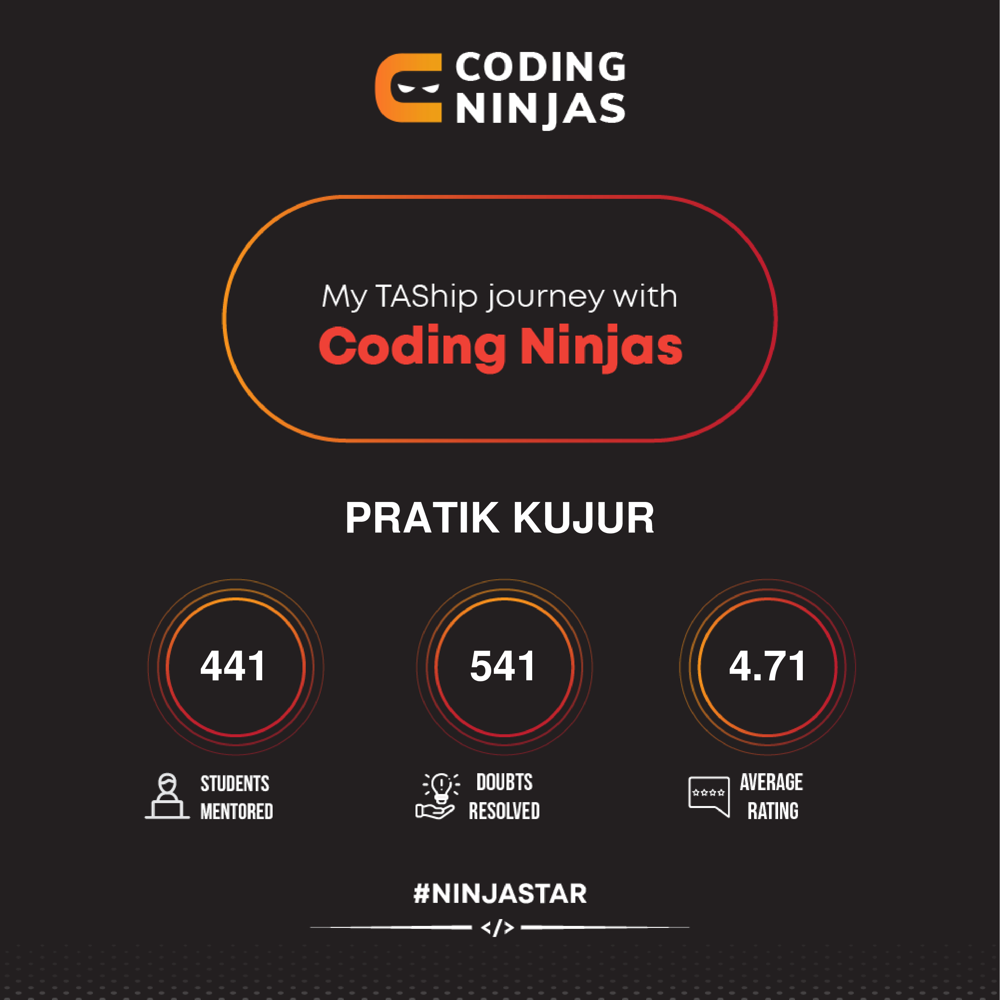

# 💫 About Me:
I am an engineering graduate specialising in Electrical Engineering from the Indian Institute of Engineering Science and Technology, Shibpur (IIESTS). I am a passionate learner who loves to work with different technologies and programming languages.

## 🌐 Socials:
       

# 💻 Tech Stack:
                               
# 📊 GitHub Stats:
 
 
 

## 🏆 GitHub Trophies

## 🐦 Latest Tweet

### ✍️ Random Dev Quote

---

  ## 💰 You can help me by Donating
   

  
